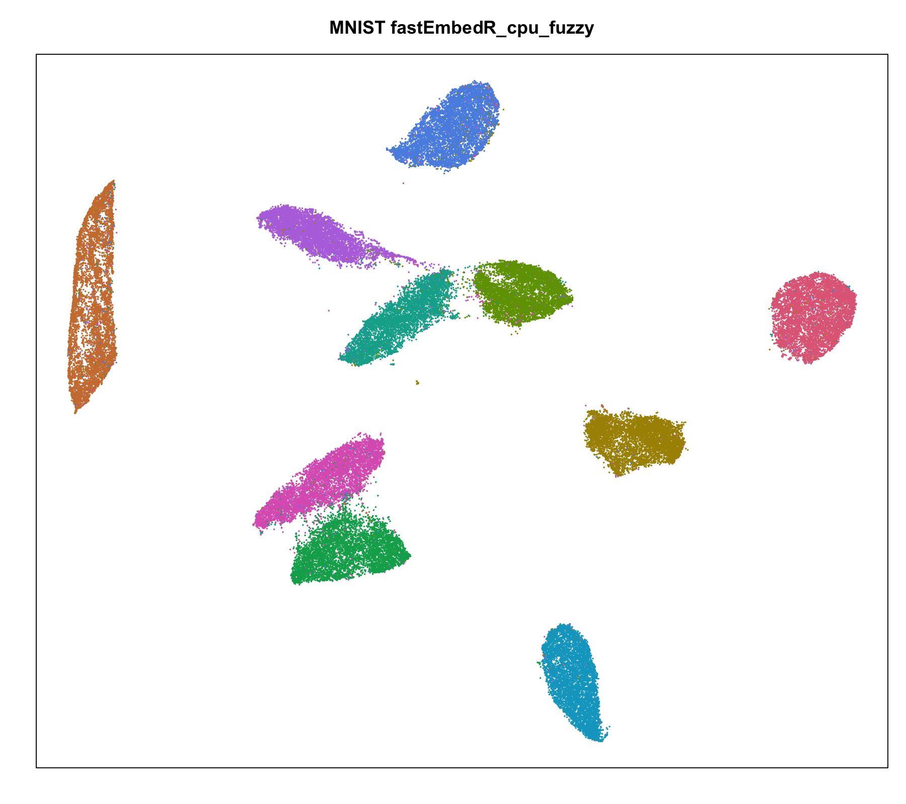
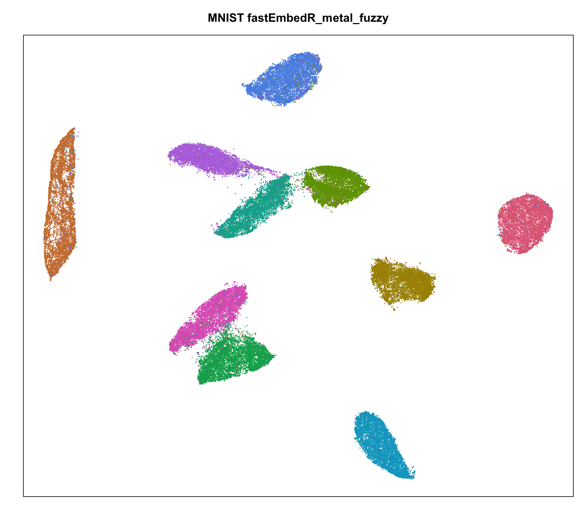
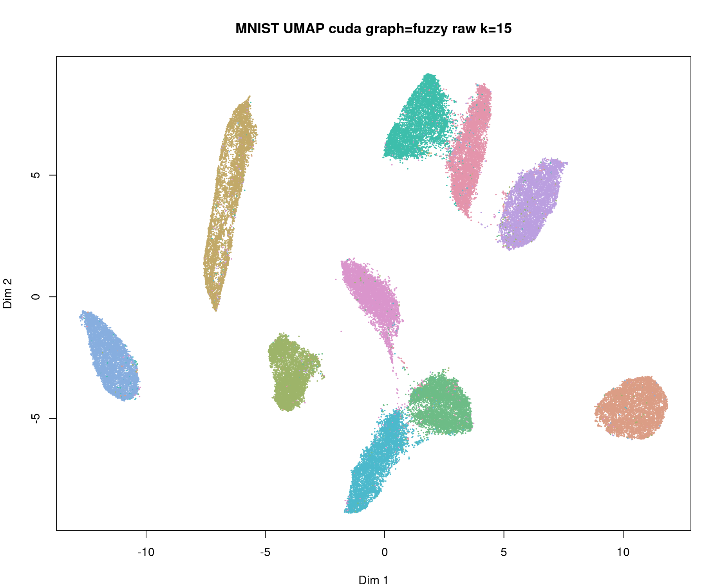
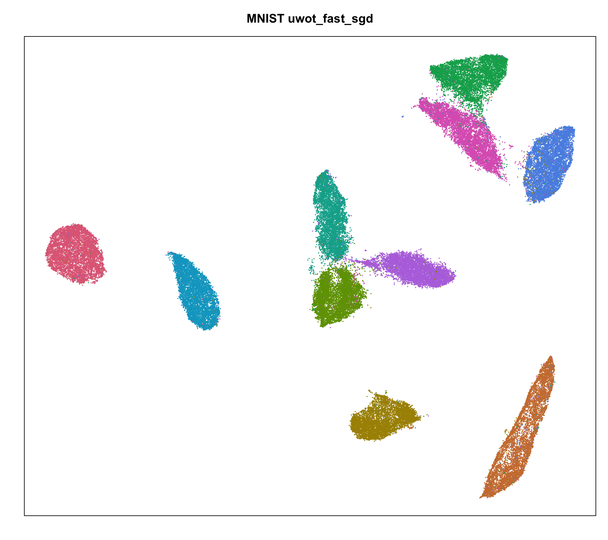

# fastEmbedR

**Home** |
[Installation](docs/installation.md) |
[Implementation](docs/implementation.md) |
[Examples](docs/examples.md) |
[Benchmarks](docs/benchmarks.md) |
[API](docs/usage-api.md) |
[Provenance](docs/algorithm-provenance.md)

`fastEmbedR` is a native R/C++ package for fast dimensionality reduction from
nearest-neighbour graphs. It focuses on:

- UMAP from KNN input;
- openTSNE-style t-SNE from KNN input;
- native CPU, Apple Metal, and CUDA embedding backends where available;
- explicit backend reporting, with no silent CPU fallback labelled as GPU;
- a small user API backed by the companion `faissR` package for FAISS/cuVS KNN.

The intended workflow is:

1. compute nearest neighbours with `fastEmbedR::nn()` or `faissR::nn()`;
2. reuse the same KNN object in `fastEmbedR::opentsne_knn()` or
   `fastEmbedR::umap_knn()`;
3. evaluate or plot the embedding.

## Quick Start

```r
library(fastEmbedR)

x <- scale(as.matrix(iris[, 1:4]))
labels <- iris$Species

knn <- fastEmbedR::nn(x, k = 15, backend = "auto", n_threads = 4)

y_tsne <- fastEmbedR::opentsne_knn(
  knn,
  init_data = x,
  backend = "cpu",
  seed = 1
)

y_umap <- fastEmbedR::umap_knn(
  knn,
  backend = "cpu",
  graph_mode = "fuzzy",
  seed = 1
)

plot(y_tsne, pch = 21, bg = labels)
plot(y_umap, pch = 21, bg = labels)
```

## Main Functions

| Function | Purpose |
| --- | --- |
| `nn()` | Thin wrapper around `faissR::nn()` for FAISS/cuVS neighbour search. |
| `opentsne_knn()` | Native openTSNE-style t-SNE from a supplied KNN object. |
| `opentsne()` | One-call KNN plus openTSNE-style t-SNE. |
| `umap_knn()` | Native UMAP from a supplied KNN object. |
| `umap()` | One-call KNN plus UMAP. |
| `landmark_tsne()` / `landmark_umap()` | Landmark embedding and projection workflows. |
| `evaluate_embedding()` | Trustworthiness, neighbour preservation, label accuracy, and related metrics. |
| `backend_info()` | Report CPU, Metal, CUDA, FAISS, and cuVS availability. |

## Installation

For the development version:

```r
install.packages("remotes")
remotes::install_github("tkcaccia/faissR")
remotes::install_github("tkcaccia/fastEmbedR")
```

See [Installation](docs/installation.md) for FAISS, cuVS, CUDA, Metal, and
system-library details.

## MNIST 70k Examples

The benchmark examples use flattened 28x28 MNIST images. They compare:

- `fastEmbedR::opentsne()` with CPU, Metal, and CUDA backends;
- `Rtsne::Rtsne()` as the full Rtsne baseline using its own neighbour search;
- `fastEmbedR::umap(..., graph_mode = "fuzzy")` with CPU, Metal, and CUDA
  backends;
- `uwot::umap(..., fast_sgd = TRUE)` as the full uwot baseline using its own
  neighbour search.

`graph_mode = "binary"` is not shown in the GitHub benchmark summary.

See [Examples](docs/examples.md) and [Benchmarks](docs/benchmarks.md).

## Gallery

### openTSNE CPU / Metal / CUDA


### UMAP Fuzzy Graph Only

| fastEmbedR CPU fuzzy | fastEmbedR Metal fuzzy | fastEmbedR CUDA fuzzy | uwot fast_sgd |
| --- | --- | --- | --- |
|  |  |  |  |

## Implementation And References

The implementation details and acknowledgements are split across:

- [Implementation](docs/implementation.md)
- [Function implementation details](docs/function-implementation-details.md)
- [Algorithm design, improvements, and acknowledgements](docs/algorithm-provenance.md)
- [Installed NOTICE](inst/NOTICE)
- [Algorithmic references](inst/ALGORITHMIC_REFERENCES.md)

In short:

- UMAP is implemented in package-native C++ with Metal and CUDA kernels for
  selected GPU paths.
- openTSNE-style t-SNE uses sparse KNN affinities and FFT-grid/FIt-SNE-style
  negative-gradient approximation, with native Metal and CUDA paths where
  compiled.
- `faissR` owns FAISS/cuVS KNN, graph building, kNN prediction, and k-means.
- `uwot`, `Rtsne`, FIt-SNE, openTSNE, cuML/cuVS, AppleSiliconFFT, and related
  papers are acknowledged as references or optional benchmark tools according
  to their licenses.

## License

`fastEmbedR` is distributed under the MIT license. GPL packages such as `uwot`
are used only as optional external benchmark/reference tools, not as required
runtime dependencies or vendored source.
