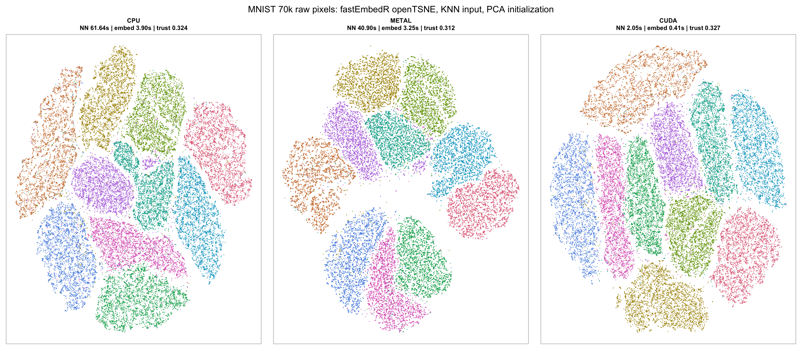
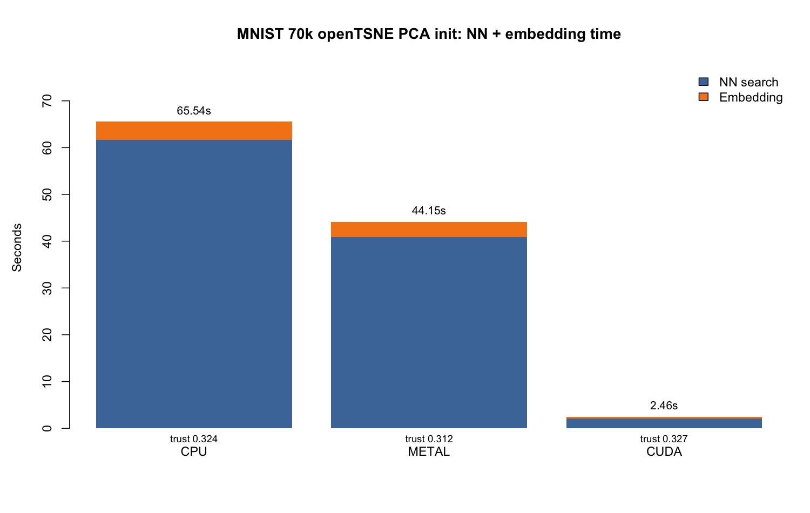

# Benchmark Gallery

This gallery collects plots intended for the GitHub page and later manuscript
figures. The goal is to show both speed and the actual embedding output,
because runtime without visual and quantitative quality is not useful.

## MNIST 70k: openTSNE PCA Initialization

This run used raw flattened 28x28 MNIST images, precomputed KNN input, and PCA
initialization for `fastEmbedR::opentsne_knn()`.





| backend | machine | NN sec | embedding sec | total sec | trust | label KNN acc |
| --- | --- | ---: | ---: | ---: | ---: | ---: |
| CPU | Stefanos-MacBook-Pro.local | 61.642 | 3.896 | 65.538 | 0.324 | 0.958 |
| Metal | Stefanos-MacBook-Pro.local | 40.904 | 3.250 | 44.154 | 0.312 | 0.966 |
| CUDA | icgeb-bioinformatics-unit | 2.046 | 0.410 | 2.456 | 0.327 | 0.972 |

Source data:
[assets/mnist70k-opentsne-pca-timing.csv](assets/mnist70k-opentsne-pca-timing.csv).

The figure was generated with:

```sh
Rscript tools/make_mnist70k_pca_github_figures.R \
  --local-dir=results/mnist70k_pca_opentsne_github_local_20260612_214031 \
  --cuda-dir=results/chiamaka_mnist70k_cpu_cuda_20260612_150230/results \
  --out-dir=docs/assets
```

## How To Add A Dataset Panel

For every new dataset added to this gallery, include:

- the embedding plot for CPU, Metal, and CUDA where available;
- the reference R package plot when relevant, for example `uwot` or `Rtsne`;
- a timing table with nearest-neighbour, embedding, and projection/transform
  columns separated;
- trustworthiness and label KNN accuracy when labels are available;
- a short note about whether the method used full embedding or landmarking.

Recommended next gallery datasets:

- Fashion-MNIST 70k;
- Shuttle;
- Covertype;
- SingleCell/MetRef on the CUDA workstation;
- CIFAR-style image features.
