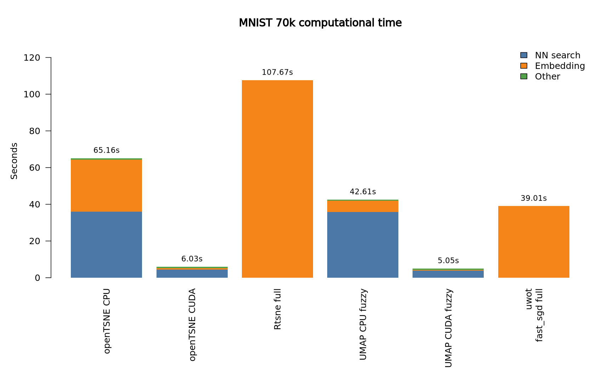
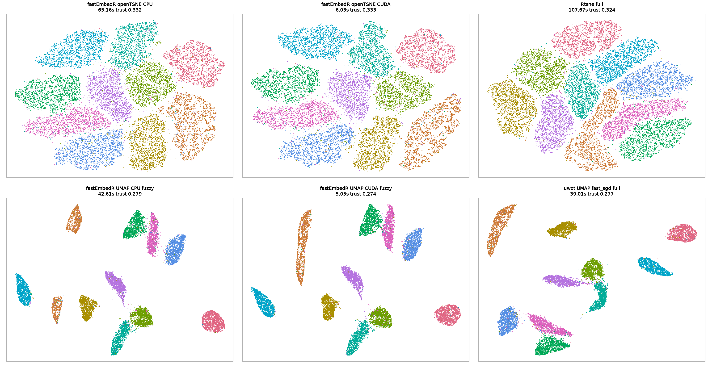

# Examples

[Home](../README.md) |
[Installation](installation.md) |
[Implementation](implementation.md) |
**Examples** |
[Benchmarks](benchmarks.md) |
[API](usage-api.md) |
[References](references.md)

## Iris KNN-First Workflow

```r
library(fastEmbedR)

x <- scale(as.matrix(iris[, 1:4]))
labels <- iris$Species

knn <- faissR::nn(x, k = 15, backend = "auto", n_threads = 4)

y_tsne <- fastEmbedR::opentsne_knn(knn, init_data = x, backend = "cpu", seed = 1)
y_umap <- fastEmbedR::umap_knn(knn, backend = "cpu", graph_mode = "fuzzy", seed = 1)

plot(y_tsne, pch = 21, bg = labels)
plot(y_umap, pch = 21, bg = labels)
```

## Iris One-Call openTSNE

```r
fit <- fastEmbedR::opentsne(
  x,
  perplexity = 30,
  backend = "cpu",
  n_threads = 4,
  seed = 1
)

plot(fit)
fit$metrics
```

Use `backend = "metal"` on Apple Silicon or `backend = "cuda"` on a CUDA build.
Explicit GPU requests fail clearly if the backend is unavailable.
For matrix input, the KNN search is fixed inside `opentsne()`: CPU and Metal
use FAISS CPU IVF-Flat, while CUDA uses FAISS GPU IVF-Flat. The internal
non-self KNN width is `ceiling(perplexity)`. Use
`opentsne_knn()` with an explicit `faissR::nn()` result when benchmarking alternative
KNN algorithms.

## Iris One-Call UMAP

For standard UMAP comparison use the fuzzy graph:

```r
fit <- fastEmbedR::umap(
  x,
  n_neighbors = 30,
  backend = "cpu",
  graph_mode = "fuzzy",
  n_threads = 4,
  seed = 1
)

plot(fit)
fit$metrics
```

For matrix input, `umap()` uses the same fixed KNN policy as `opentsne()`.
Use `umap_knn()` when you want to reuse or benchmark a separately computed KNN
object.

## MNIST 70k Benchmark Example

The benchmark script uses the full 70,000 MNIST observations as flattened
28x28 images. It can either download the public IDX files or load a prepared
`.RData` object with `data` and `labels` fields.

The CUDA run below was executed on `chiamaka` on 2026-06-18 using the prepared
dataset at `/mnt/sata_ssd/fastEmbedR/Data/MNIST/MNIST.RData`. CPU paths were
requested with 4 threads for KNN search and embedding:

```sh
export OMP_NUM_THREADS=4
export OPENBLAS_NUM_THREADS=4
export MKL_NUM_THREADS=4
export RCPP_PARALLEL_NUM_THREADS=4

singularity exec --nv -B /mnt/sata_ssd:/mnt/sata_ssd \
  /mnt/sata_ssd/fastEmbedR/singularity/fastembedr_cuda.sif \
  /opt/conda/bin/Rscript /mnt/sata_ssd/fastEmbedR/tools/benchmark_github_mnist70k.R \
  --mnist-rdata=/mnt/sata_ssd/fastEmbedR/Data/MNIST/MNIST.RData \
  --n=70000 \
  --k=15 \
  --perplexity=15 \
  --threads=4 \
  --run-metal=false \
  --run-cuda=true \
  --run-references=true \
  --out-dir=/mnt/sata_ssd/fastEmbedR/results/github_mnist70k_cuda_thread4_20260618_170053
```

The script compares:

- `fastEmbedR::opentsne()` on CPU, Metal, and/or CUDA;
- `Rtsne::Rtsne()` as the full Rtsne baseline with its own internal KNN;
- `fastEmbedR::umap(..., graph_mode = "fuzzy")` on CPU, Metal, and/or CUDA;
- `uwot::umap(..., fast_sgd = TRUE)` as the full uwot baseline with its own
  internal KNN.

This run used:

- Machine: `icgeb-bioinformatics-unit`
- System: Linux 6.8.0-124-generic, x86_64
- CPU: 13th Gen Intel(R) Core(TM) i7-13700
- GPU: NVIDIA GeForce RTX 5060 Ti, driver 595.71.05, 16311 MiB
- RAM: 31.02 GB
- R: 4.5.3
- fastEmbedR: 0.1.0
- faissR: 0.1.0
- uwot: 0.2.4
- Rtsne: 0.17
- Requested benchmark threads: 4

The benchmark intentionally does not show `graph_mode = "binary"`.

### MNIST 70k Results



| method | backend | KNN backend | NN sec | embedding sec | total sec | trust | label KNN acc |
| --- | --- | --- | ---: | ---: | ---: | ---: | ---: |
| fastEmbedR openTSNE CPU | CPU | faiss_ivf | 35.979 | 28.331 | 65.155 | 0.332 | 0.968 |
| fastEmbedR openTSNE CUDA | CUDA | faiss_gpu_ivf_flat | 4.350 | 0.903 | 6.033 | 0.333 | 0.969 |
| Rtsne full | CPU | internal | internal | 107.674 | 107.674 | 0.324 | 0.973 |
| fastEmbedR UMAP CPU fuzzy | CPU | faiss_ivf | 35.844 | 6.043 | 42.610 | 0.279 | 0.971 |
| fastEmbedR UMAP CUDA fuzzy | CUDA | faiss_gpu_ivf_flat | 3.760 | 0.532 | 5.049 | 0.274 | 0.971 |
| uwot UMAP fast_sgd full | CPU | internal | internal | 39.008 | 39.008 | 0.277 | 0.970 |

For fastEmbedR matrix-input runs, CPU KNN used `faiss_ivf` and CUDA KNN used
`faiss_gpu_ivf_flat`. The reference methods use their own internal neighbour
search, so the table reports their full runtime as embedding/runtime.



Source files:

- [mnist70k_github_benchmark.csv](assets/mnist70k_cuda_codex_20260618/mnist70k_github_benchmark.csv)
- [machine-specs.md](assets/mnist70k_cuda_codex_20260618/machine-specs.md)
