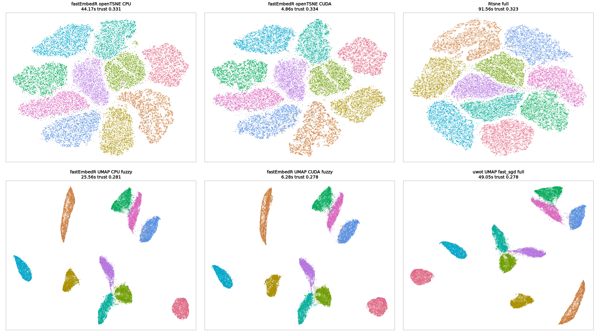

# Examples

[Home](../README.md) |
[Installation](installation.md) |
[Implementation](implementation.md) |
**Examples** |
[Benchmarks](benchmarks.md) |
[API](usage-api.md) |
[References](references.md)

## Iris KNN-First Workflow

```r
library(fastEmbedR)

x <- scale(as.matrix(iris[, 1:4]))
labels <- iris$Species

knn <- faissR::nn(x, k = 15, exclude_self = TRUE, backend = "auto", n_threads = 4)

y_tsne <- fastEmbedR::opentsne_knn(knn, init_data = x, backend = "cpu", seed = 1)
y_umap <- fastEmbedR::umap_knn(knn, backend = "cpu", graph_mode = "fuzzy", seed = 1)

plot(y_tsne, pch = 21, bg = labels)
plot(y_umap, pch = 21, bg = labels)
```

## Iris One-Call openTSNE

```r
fit <- fastEmbedR::opentsne(
  x,
  perplexity = 30,
  backend = "cpu",
  n_threads = 4,
  seed = 1
)

plot(fit)
fit$metrics
```

Use `backend = "metal"` on Apple Silicon or `backend = "cuda"` on a CUDA build.
Explicit GPU requests fail clearly if the backend is unavailable.
For matrix input, the KNN search is delegated to faissR through fastEmbedR's internal bridge:
CPU and Metal use faissR CPU HNSW with `target_recall = 0.99`, while CUDA uses
faissR's CUDA policy. The internal non-self KNN width is `ceiling(perplexity)`. Use
`opentsne_knn()` with an explicit `faissR::nn()` result when benchmarking alternative
KNN algorithms.

## Iris One-Call UMAP

For standard UMAP comparison use the fuzzy graph:

```r
fit <- fastEmbedR::umap(
  x,
  n_neighbors = 30,
  backend = "cpu",
  graph_mode = "fuzzy",
  n_threads = 4,
  seed = 1
)

plot(fit)
fit$metrics
```

For matrix input, `umap()` uses the same fixed KNN policy as `opentsne()`.
Use `umap_knn()` when you want to reuse or benchmark a separately computed KNN
object.

## MNIST 70k Benchmark Example

The example below uses the full 70,000 MNIST observations as flattened 28x28
images. CPU paths are requested with 4 threads. The result figure places
t-SNE/openTSNE methods on the first row and UMAP methods on the second row.

```r
library(fastEmbedR)
library(Rtsne)
library(uwot)

Sys.setenv(
  OMP_NUM_THREADS = "4",
  OPENBLAS_NUM_THREADS = "4",
  MKL_NUM_THREADS = "4",
  RCPP_PARALLEL_NUM_THREADS = "4"
)

load("/path/to/MNIST.RData")          # classic object named dataset
x_ref <- as.matrix(dataset$data)
labels <- as.factor(dataset$labels)

x_fast <- x_ref

k <- 30
perplexity <- 15
seed <- 4

time_it <- function(expr) {
  t0 <- proc.time()[["elapsed"]]
  value <- force(expr)
  list(value = value, sec = proc.time()[["elapsed"]] - t0)
}

set.seed(seed)
opentsne_cpu <- time_it(
  fastEmbedR::opentsne(x_fast, perplexity = perplexity, backend = "cpu",
                       n_threads = 4, seed = seed)
)

set.seed(seed)
opentsne_cuda <- time_it(
  fastEmbedR::opentsne(x_fast, perplexity = perplexity, backend = "cuda",
                       n_threads = 4, seed = seed)
)

set.seed(seed)
rtsne_full <- time_it(
  Rtsne::Rtsne(x_ref, perplexity = perplexity, check_duplicates = FALSE,
               pca = TRUE, num_threads = 4)
)

set.seed(seed)
umap_cpu <- time_it(
  fastEmbedR::umap(x_fast, n_neighbors = k, backend = "cpu",
                   graph_mode = "fuzzy", n_threads = 4, seed = seed)
)

set.seed(seed)
umap_cuda <- time_it(
  fastEmbedR::umap(x_fast, n_neighbors = k, backend = "cuda",
                   graph_mode = "fuzzy", n_threads = 4, seed = seed)
)

set.seed(seed)
uwot_fast <- time_it(
  uwot::umap(x_ref, n_neighbors = k, fast_sgd = TRUE,
             n_threads = 4, n_sgd_threads = 4, verbose = FALSE)
)

layout_of <- function(obj) {
  y <- obj$value
  if (is.list(y) && !is.null(y$layout)) y <- y$layout
  if (is.list(y) && !is.null(y$Y)) y <- y$Y
  as.matrix(y)
}

layouts <- list(
  "fastEmbedR openTSNE CPU" = layout_of(opentsne_cpu),
  "fastEmbedR openTSNE CUDA" = layout_of(opentsne_cuda),
  "Rtsne full" = layout_of(rtsne_full),
  "fastEmbedR UMAP CPU fuzzy" = layout_of(umap_cpu),
  "fastEmbedR UMAP CUDA fuzzy" = layout_of(umap_cuda),
  "uwot UMAP fast_sgd full" = layout_of(uwot_fast)
)

timing <- data.frame(
  method = names(layouts),
  total_sec = c(opentsne_cpu$sec, opentsne_cuda$sec, rtsne_full$sec,
                umap_cpu$sec, umap_cuda$sec, uwot_fast$sec)
)

print(timing)

cols <- as.integer(labels)
par(mfrow = c(2, 3), mar = c(1, 1, 3, 1))
for (nm in names(layouts)) {
  y <- layouts[[nm]]
  plot(y[, 1], y[, 2], pch = 16, cex = 0.22, col = cols,
       axes = FALSE, xlab = "", ylab = "", main = nm)
  box(col = "grey70")
}
```

The example compares:

- `fastEmbedR::opentsne()` on CPU, Metal, and/or CUDA;
- `Rtsne::Rtsne()` as the full Rtsne baseline with its own internal KNN;
- `fastEmbedR::umap(..., graph_mode = "fuzzy")` on CPU, Metal, and/or CUDA;
- `uwot::umap(..., fast_sgd = TRUE)` as the full uwot baseline with its own
  internal KNN.

This run used:

- Machine: `icgeb-bioinformatics-unit`
- System: Linux 6.8.0-124-generic, x86_64
- CPU: 13th Gen Intel(R) Core(TM) i7-13700
- GPU: NVIDIA GeForce RTX 5060 Ti, driver 595.71.05, 16311 MiB
- RAM: 31.02 GB
- R: 4.5.3
- fastEmbedR: 0.1.0
- faissR: 0.1.0
- uwot: 0.2.4
- Rtsne: 0.17
- Requested benchmark threads: 4

The benchmark intentionally does not show `graph_mode = "binary"`.

### MNIST 70k Results


| method | backend | total sec | trust | label KNN acc |
| --- | --- | ---: | ---: | ---: |
| fastEmbedR openTSNE CPU | CPU | 44.174 | 0.331 | 0.970 |
| fastEmbedR openTSNE CUDA | CUDA | 4.861 | 0.334 | 0.969 |
| Rtsne full | CPU | 91.557 | 0.323 | 0.972 |
| fastEmbedR UMAP CPU fuzzy | CPU | 25.562 | 0.281 | 0.972 |
| fastEmbedR UMAP CUDA fuzzy | CUDA | 6.279 | 0.278 | 0.971 |
| uwot UMAP fast_sgd full | CPU | 49.047 | 0.278 | 0.969 |



Source files:

- [mnist70k_github_benchmark.csv](assets/mnist70k_cuda_codex_20260621_4threads/mnist70k_github_benchmark.csv)
- [machine-specs.md](assets/mnist70k_cuda_codex_20260621_4threads/machine-specs.md)
