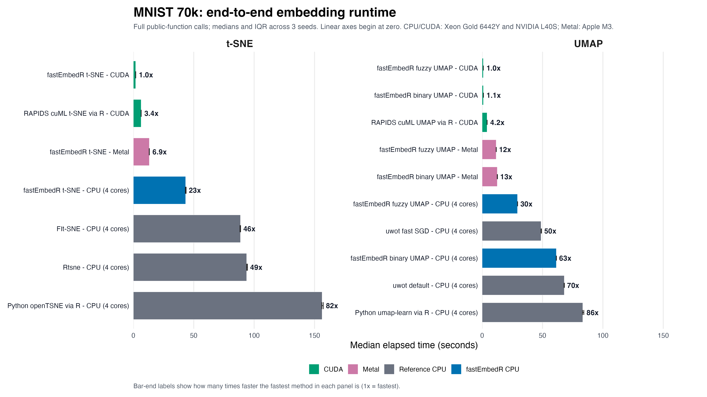
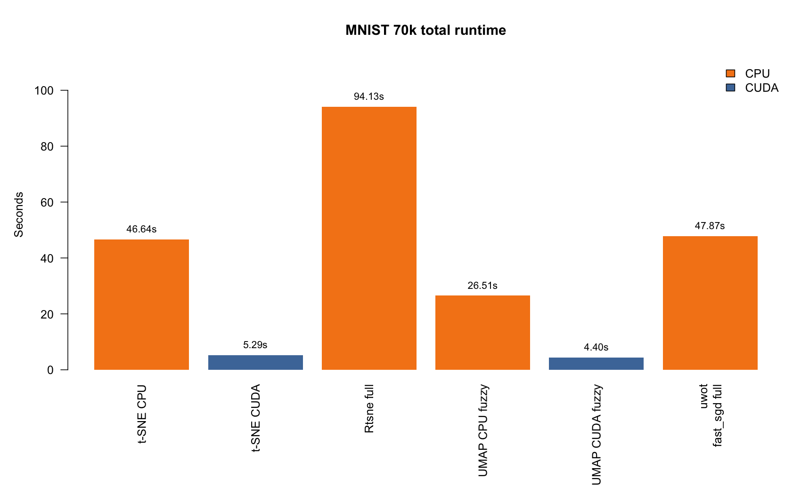
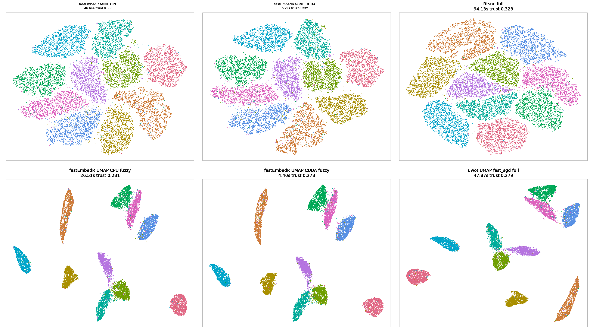

# Examples

[Home](../README.md) |
[Installation](installation.md) |
[Bioconductor](bioconductor.md) |
[Implementation](implementation.md) |
**Examples** |
[Benchmarks](benchmarks.md) |
[API](usage-api.md) |
[Reproducibility](reproducibility.md) |
[References](references.md)

## Iris KNN-First Workflow

```r
library(fastEmbedR)

x <- scale(as.matrix(iris[, 1:4]))
labels <- iris$Species

y_tsne <- fastEmbedR::tsne(
  x, perplexity = 10, backend = "cpu", n.cores = 4, seed = 1
)$layout
y_umap <- fastEmbedR::umap(
  x, n_neighbors = 15, backend = "cpu", n.cores = 4,
  graph_mode = "fuzzy", seed = 1
)$layout

plot(y_tsne, pch = 21, bg = labels)
plot(y_umap, pch = 21, bg = labels)
```

## Iris One-Call t-SNE

```r
fit <- fastEmbedR::tsne(
  x,
  perplexity = 30,
  backend = "cpu",
  n.cores = 4,
  seed = 1
)

plot(fit)
fit$metrics
```

Use `backend = "metal"` on Apple Silicon or `backend = "cuda"` on a CUDA build.
Explicit GPU requests fail clearly if the backend is unavailable.
For matrix input, CPU uses native HNSW and Metal uses native exact or
recall-tuned IVF-Flat. CUDA uses package-native cuVS GPU-resident KNN. The
default compact non-self affinity support is `ceiling(perplexity)`. The
supplied KNN is trimmed to that width. Use `tsne_knn()` with a plain
precomputed host KNN list when benchmarking another search implementation.

## Iris One-Call UMAP

Standard UMAP fuzzy weighting is the default:

```r
fit <- fastEmbedR::umap(
  x,
  n_neighbors = 30,
  backend = "cpu",
  n.cores = 4,
  seed = 1
)

plot(fit)
fit$metrics
```

For matrix input, `umap()` uses the same fixed KNN policy as `tsne()`.
Use `umap_knn()` when you want to reuse or benchmark a separately computed KNN
object.

## MNIST 70k Benchmark Example

The example below uses the full 70,000 MNIST observations as flattened 28x28
images. CPU paths are requested with 4 threads. The result figure places
t-SNE methods on the first row and UMAP methods on the second row.

```r
library(fastEmbedR)
library(Rtsne)
library(uwot)

Sys.setenv(
  OMP_NUM_THREADS = "4",
  OPENBLAS_NUM_THREADS = "4",
  MKL_NUM_THREADS = "4",
  RCPP_PARALLEL_NUM_THREADS = "4"
)

load("/path/to/MNIST.RData")          # classic object named dataset
x_ref <- as.matrix(dataset$data)
labels <- as.factor(dataset$labels)

x_fast <- x_ref
out_dir <- "mnist70k_fastembedr_example"
dir.create(out_dir, showWarnings = FALSE, recursive = TRUE)

k <- 30
perplexity <- 15
seed <- 4

time_it <- function(expr) {
  t0 <- proc.time()[["elapsed"]]
  value <- force(expr)
  list(value = value, sec = proc.time()[["elapsed"]] - t0)
}

layout_of <- function(obj) {
  y <- obj$value
  if (is.list(y) && !is.null(y$layout)) y <- y$layout
  if (is.list(y) && !is.null(y$Y)) y <- y$Y
  as.matrix(y)
}

run_method <- function(method, backend, expr) {
  set.seed(seed)
  ans <- tryCatch(time_it(expr), error = function(e) e)
  if (inherits(ans, "error")) {
    data.frame(method = method, backend = backend, total_sec = NA_real_,
               status = "failed", error_message = conditionMessage(ans))
  } else {
    layouts[[method]] <<- layout_of(ans)
    data.frame(method = method, backend = backend, total_sec = ans$sec,
               status = "success", error_message = NA_character_)
  }
}

layouts <- list()
results <- list()

results[[length(results) + 1L]] <- run_method(
  "fastEmbedR t-SNE CPU", "cpu",
  fastEmbedR::tsne(x_fast, perplexity = perplexity, backend = "cpu",
                       n.cores = 4, seed = seed)
)

results[[length(results) + 1L]] <- run_method(
  "fastEmbedR t-SNE CUDA", "cuda",
  fastEmbedR::tsne(x_fast, perplexity = perplexity, backend = "cuda",
                       n.cores = 4, seed = seed)
)

results[[length(results) + 1L]] <- run_method(
  "Rtsne full", "cpu",
  Rtsne::Rtsne(x_ref, perplexity = perplexity, check_duplicates = FALSE,
               pca = TRUE, num_threads = 4)
)

results[[length(results) + 1L]] <- run_method(
  "fastEmbedR UMAP CPU fuzzy", "cpu",
  fastEmbedR::umap(x_fast, n_neighbors = k, backend = "cpu",
                   graph_mode = "fuzzy", n.cores = 4, seed = seed)
)

results[[length(results) + 1L]] <- run_method(
  "fastEmbedR UMAP CUDA fuzzy", "cuda",
  fastEmbedR::umap(x_fast, n_neighbors = k, backend = "cuda",
                   graph_mode = "fuzzy", n.cores = 4, seed = seed)
)

results[[length(results) + 1L]] <- run_method(
  "uwot UMAP fast_sgd full", "cpu",
  uwot::umap(x_ref, n_neighbors = k, fast_sgd = TRUE,
             n_threads = 4, n_sgd_threads = 4, verbose = FALSE)
)

timing <- do.call(rbind, results)
write.csv(timing, file.path(out_dir, "mnist70k_timing.csv"), row.names = FALSE)

print(timing)

ok <- timing$status == "success"
png(file.path(out_dir, "mnist70k_time_barplot.png"), width = 1200, height = 700, res = 140)
op <- par(mar = c(8, 4, 2, 1))
barplot(timing$total_sec[ok], names.arg = timing$method[ok],
        las = 2, ylab = "Total time (seconds)", col = "#4C78A8")
par(op)
dev.off()

cols <- as.integer(labels)
png(file.path(out_dir, "mnist70k_embeddings.png"), width = 2700, height = 1560, res = 150)
par(mfrow = c(2, 3), mar = c(1, 1, 3, 1))
for (nm in names(layouts)) {
  y <- layouts[[nm]]
  plot(y[, 1], y[, 2], pch = 16, cex = 0.22, col = cols,
       axes = FALSE, xlab = "", ylab = "", main = nm)
  box(col = "grey70")
}
dev.off()
```

The example compares:

- `fastEmbedR::tsne()` on CPU, Metal, and/or CUDA;
- `Rtsne::Rtsne()` as the full Rtsne baseline with its own internal KNN;
- `fastEmbedR::umap(..., graph_mode = "fuzzy")` on CPU, Metal, and/or CUDA;
- `uwot::umap(..., fast_sgd = TRUE)` as the full uwot baseline with its own
  internal KNN.

This run used:

- Machine: `icgeb-bioinformatics-unit`
- System: Linux 6.8.0-124-generic, x86_64
- CPU: 13th Gen Intel(R) Core(TM) i7-13700
- GPU: NVIDIA GeForce RTX 5060 Ti, driver 595.71.05, 16311 MiB
- RAM: 31.02 GB
- R: 4.5.3
- fastEmbedR: 0.1.0
- uwot: 0.2.4
- Rtsne: 0.17
- Requested benchmark threads: 4

The benchmark intentionally does not show `graph_mode = "binary"`.

### MNIST 70k Results

The following presentation view summarizes the publication benchmark rather
than the single run shown below. It reports median end-to-end public-function
runtime and interquartile range over three seeds on linear axes with a true
zero baseline. Bar-end labels state how many times faster the fastest method
in each panel was (`1x` marks the fastest method). CPU and CUDA measurements
used an Intel Xeon Gold 6442Y and NVIDIA L40S; Metal measurements used an
Apple M3 and are identified separately rather than treated as matched-machine
comparisons.



Presentation assets:

- [vector PDF](assets/mnist70k_presentation_runtime_20260801/mnist70k_runtime_linear_slide.pdf)
- [plotted medians and IQRs](assets/mnist70k_presentation_runtime_20260801/mnist70k_runtime_linear_plot_data.csv)
- [reproducible plotting script](https://github.com/tkcaccia/fastEmbedR-extra/blob/main/benchmarks/legacy/fastEmbedR-benchmark/tools/make_mnist70k_presentation_runtime_plot.R)

The single-run example output remains below so that its table, machine
description, and embedding panels stay tied to the executable R example.



| method | backend | total sec | trust | label KNN acc |
| --- | --- | ---: | ---: | ---: |
| fastEmbedR t-SNE CPU | CPU | 46.640 | 0.330 | 0.969 |
| fastEmbedR t-SNE CUDA | CUDA | 5.286 | 0.332 | 0.965 |
| Rtsne full | CPU | 94.131 | 0.323 | 0.972 |
| fastEmbedR UMAP CPU fuzzy | CPU | 26.507 | 0.281 | 0.971 |
| fastEmbedR UMAP CUDA fuzzy | CUDA | 4.397 | 0.278 | 0.970 |
| uwot UMAP fast_sgd full | CPU | 47.866 | 0.279 | 0.970 |



Source files:

- [mnist70k_github_benchmark.csv](assets/mnist70k_cuda_codex_20260621_4threads/mnist70k_github_benchmark.csv)
- [machine-specs.md](assets/mnist70k_cuda_codex_20260621_4threads/machine-specs.md)
