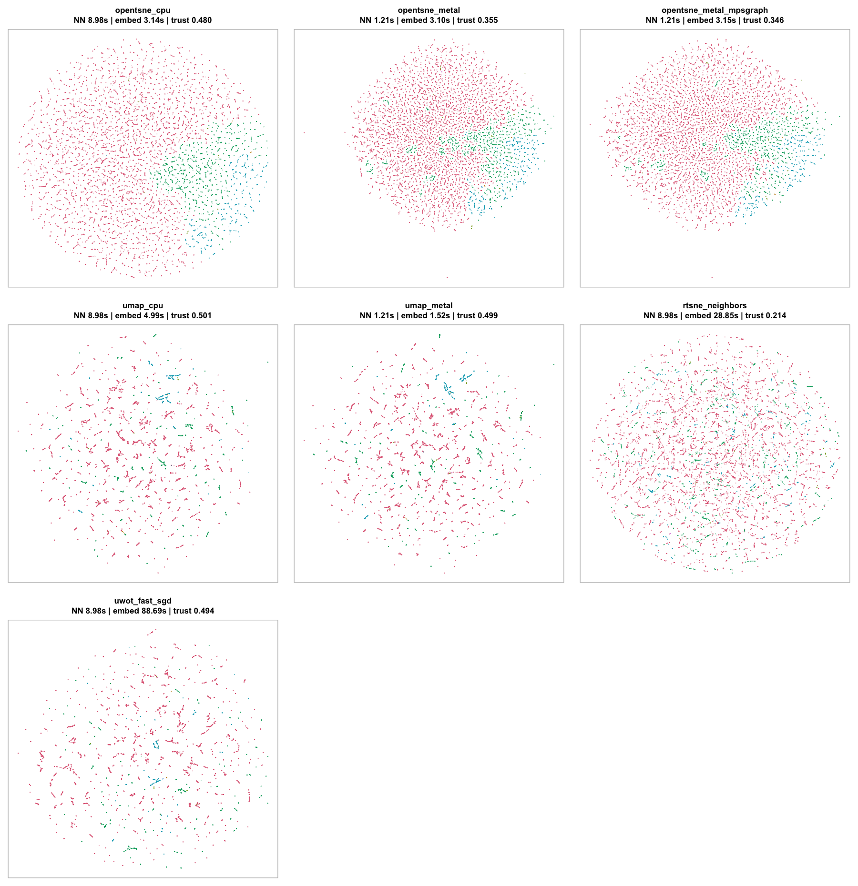
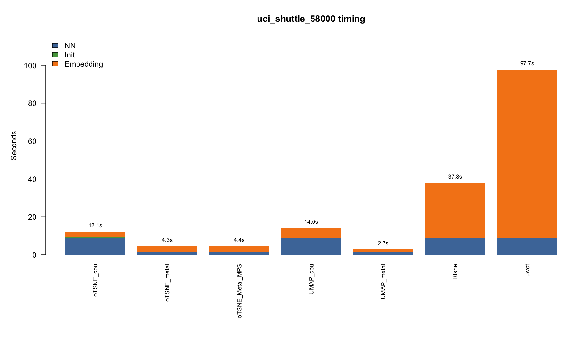

# Extended Benchmark Suite

This page documents the broader benchmark runner for datasets commonly used to
evaluate UMAP, t-SNE, and openTSNE-style methods. The runner is intentionally
kept in `tools/` because benchmark code is not part of the public package API.

## Runner

```sh
Rscript tools/benchmark_extended_dr_datasets.R \
  --datasets=mnist,fashion_mnist,shuttle,covertype,cifar10 \
  --methods=opentsne_cpu,opentsne_metal,opentsne_metal_mpsgraph,umap_cpu,umap_metal,rtsne_neighbors,uwot_fast_sgd \
  --max-n=70000 \
  --pca-dims=50 \
  --k=50 \
  --threads=4
```

On a CUDA machine, use:

```sh
Rscript tools/benchmark_extended_dr_datasets.R \
  --datasets=mnist,fashion_mnist,shuttle,covertype,cifar10 \
  --methods=opentsne_cpu,opentsne_cuda,umap_cpu,umap_cuda,rtsne_neighbors,uwot_fast_sgd \
  --max-n=70000 \
  --pca-dims=50 \
  --k=50 \
  --threads=4
```

## Datasets

The default extended benchmark uses datasets that are common in dimensionality
reduction examples and papers and can be downloaded automatically without
Kaggle credentials or manual login.

| Dataset key | Type | Source | Why included |
| --- | --- | --- | --- |
| `mnist` | image digits | official public IDX files mirrored by Google | standard t-SNE/UMAP visual benchmark |
| `fashion_mnist` | image classes | Zalando Research Fashion-MNIST IDX files | harder image-cluster benchmark than MNIST |
| `shuttle` | tabular classes | UCI Statlog Shuttle or OpenML fallback | large low-dimensional imbalanced tabular data |
| `covertype` | tabular classes | UCI Covertype or sklearn fallback | large heterogeneous tabular benchmark |
| `cifar10` | image features | Toronto CIFAR-10 Python files, converted to RGB 8x8 block means | image benchmark with more complex class structure |
| `optsne_flow18` | flow cytometry | Belkina et al. opt-SNE Figshare Flow18parameter CSV | direct dataset used in the opt-SNE Nature Communications paper |
| `optsne_mass41` | mass cytometry | Belkina et al. opt-SNE Figshare Mass41parameter CSV | direct dataset used in the opt-SNE Nature Communications paper |
| `fastpls_singlecell` | local biological data | local fastPLS/GPUPLS folders if present | single-cell-style benchmark, skipped if absent |
| `fastpls_metref` | local metabolomics data | local fastPLS/GPUPLS folders if present | metabolomics benchmark, skipped if absent |

The opt-SNE Figshare CSV files contain the marker matrix used by Multicore
opt-SNE. The per-event expert-gated class labels are present in the annotated
FCS files, not in the public CSV matrix. The benchmark loader downloads the
class-description CSV for provenance but treats the matrix as unlabeled unless
a labelled version is added later.

Datasets described in the opt-SNE paper but not included as automatic defaults:

| Dataset | Paper/source note | Current benchmark status |
| --- | --- | --- |
| Flow20M / van Unen mass cytometry | FlowRepository-linked dataset used by opt-SNE | not enabled by default because direct no-login file retrieval is less stable than Figshare |
| 10x Genomics 1.3M mouse brain cells | public 10x Genomics dataset | feasible as a separate very-large benchmark after adding sparse Matrix Market preprocessing |
| Full annotated FCS Flow18/Mass41 | Figshare FCS files | feasible if we add optional FCS parsing in tools; not required for unlabeled speed/trust benchmarks |

## Methods

| Method id | Meaning |
| --- | --- |
| `opentsne_cpu` | package-native openTSNE FFT-grid on CPU, from shared KNN |
| `opentsne_metal` | package-native Metal openTSNE FFT-grid, from Metal NN-descent KNN |
| `opentsne_metal_mpsgraph` | diagnostic MPSGraph FFT/convolution path for Metal openTSNE |
| `opentsne_cuda` | package-native CUDA openTSNE FFT-grid, using CUDA/cuFFT |
| `umap_cpu` | package-native CPU UMAP from shared KNN |
| `umap_metal` | package-native Metal UMAP from Metal NN-descent KNN |
| `umap_cuda` | package-native CUDA UMAP from cuVS NN-descent KNN |
| `rtsne_neighbors` | `Rtsne::Rtsne_neighbors()` using the same CPU KNN |
| `uwot_fast_sgd` | `uwot::umap(fast_sgd = TRUE)` using the same CPU KNN |

MPSGraph is deliberately labelled as a diagnostic method. It is not the
package default unless a future benchmark shows both better speed and matching
visual quality.

## Output

Each run writes:

- `extended_dr_results.csv`: all benchmark rows;
- `extended_dr_summary.csv`: compact successful-run summary;
- one embedding gallery PNG per dataset;
- one stacked timing PNG per dataset;
- cached prepared PCA data and backend-specific KNN graphs under
  `results/extended_dr_cache`.

Important columns:

| Column | Meaning |
| --- | --- |
| `nn_sec` | nearest-neighbour time for the backend-specific KNN graph |
| `init_sec` | PCA initialization time for openTSNE rows |
| `embedding_sec` | optimizer/layout time |
| `total_sec` | `nn_sec + embedding_sec` for KNN-input methods |
| `trustworthiness` | local-neighbourhood quality on the metric subsample |
| `knn_preservation_50` | high-dimensional to embedding neighbour overlap at k = 50 |
| `label_knn_accuracy` | label prediction from embedding neighbours, when labels are available |
| `backend_used` | actual backend that ran; GPU requests do not silently fall back to CPU |

## Current Local Shuttle Result

The first extended local benchmark was run on UCI Shuttle with 58,000 samples.
This dataset is useful because it is large, low-dimensional, and imbalanced;
it exposes both speed and quality differences that are invisible on tiny
datasets.

Command:

```sh
Rscript tools/benchmark_extended_dr_datasets.R \
  --datasets=shuttle \
  --methods=opentsne_cpu,opentsne_metal,opentsne_metal_mpsgraph,umap_cpu,umap_metal,rtsne_neighbors,uwot_fast_sgd \
  --max-n=58000 \
  --metric-n=3000 \
  --plot-n=15000 \
  --pca-dims=50 \
  --k=50 \
  --early-iter=100 \
  --normal-iter=150 \
  --umap-epochs=200 \
  --threads=4 \
  --out-dir=results/extended_dr_shuttle_local
```

Embedding gallery:



Stacked timing:



Summary:

| method | backend used | NN sec | init sec | embed sec | total sec | trust | preserve@50 | label acc |
| --- | --- | ---: | ---: | ---: | ---: | ---: | ---: | ---: |
| openTSNE CPU | CPU | 8.976 | 0.028 | 3.137 | 12.113 | 0.480 | 0.473 | 0.979 |
| openTSNE Metal | Metal | 1.214 | 0.028 | 3.103 | 4.317 | 0.355 | 0.285 | 0.942 |
| openTSNE Metal MPSGraph diagnostic | Metal MPSGraph diagnostic | 1.214 | 0.028 | 3.148 | 4.362 | 0.346 | 0.282 | 0.946 |
| Rtsne_neighbors | CPU | 8.976 | NA | 28.851 | 37.827 | 0.214 | 0.098 | 0.788 |
| UMAP CPU | CPU | 8.976 | NA | 4.988 | 13.964 | 0.501 | 0.320 | 0.922 |
| UMAP Metal | Metal | 1.214 | NA | 1.519 | 2.733 | 0.499 | 0.313 | 0.926 |
| uwot fast_sgd | CPU | 8.976 | NA | 88.694 | 97.670 | 0.494 | 0.336 | 0.902 |

The source CSV is
[assets/extended-shuttle58k-summary.csv](assets/extended-shuttle58k-summary.csv).

Interpretation:

- Metal UMAP is the strongest local result on Shuttle: about 5.1x faster than
  package CPU UMAP and about 35.7x faster than the `uwot` reference row, while
  matching the CPU and `uwot` trustworthiness values closely.
- Metal openTSNE and the MPSGraph diagnostic are much faster than CPU
  openTSNE, but they lose local-neighbourhood quality on Shuttle. This means
  MPSGraph is still diagnostic-only, not a default.
- CPU openTSNE preserves labels very well on Shuttle, but UMAP has higher
  trustworthiness on this dataset.
- `Rtsne_neighbors()` is included as a t-SNE reference from the same CPU KNN
  graph; in this configuration it is slower and lower quality than the native
  openTSNE FFT-grid path.

## Quick Smoke Test

For a short local validation:

```sh
Rscript tools/benchmark_extended_dr_datasets.R \
  --datasets=mnist,fashion_mnist \
  --methods=opentsne_cpu,opentsne_metal,opentsne_metal_mpsgraph,umap_cpu,umap_metal \
  --max-n=2000 \
  --metric-n=1000 \
  --plot-n=2000 \
  --early-iter=20 \
  --normal-iter=30 \
  --umap-epochs=50 \
  --out-dir=results/extended_dr_smoke
```

To test the opt-SNE paper datasets directly:

```sh
Rscript tools/benchmark_extended_dr_datasets.R \
  --datasets=optsne_flow18,optsne_mass41 \
  --methods=opentsne_cpu,opentsne_metal,opentsne_metal_mpsgraph,umap_cpu,umap_metal,rtsne_neighbors,uwot_fast_sgd \
  --max-n=70000 \
  --metric-n=3000 \
  --plot-n=15000 \
  --pca-dims=50 \
  --k=50 \
  --threads=4
```
